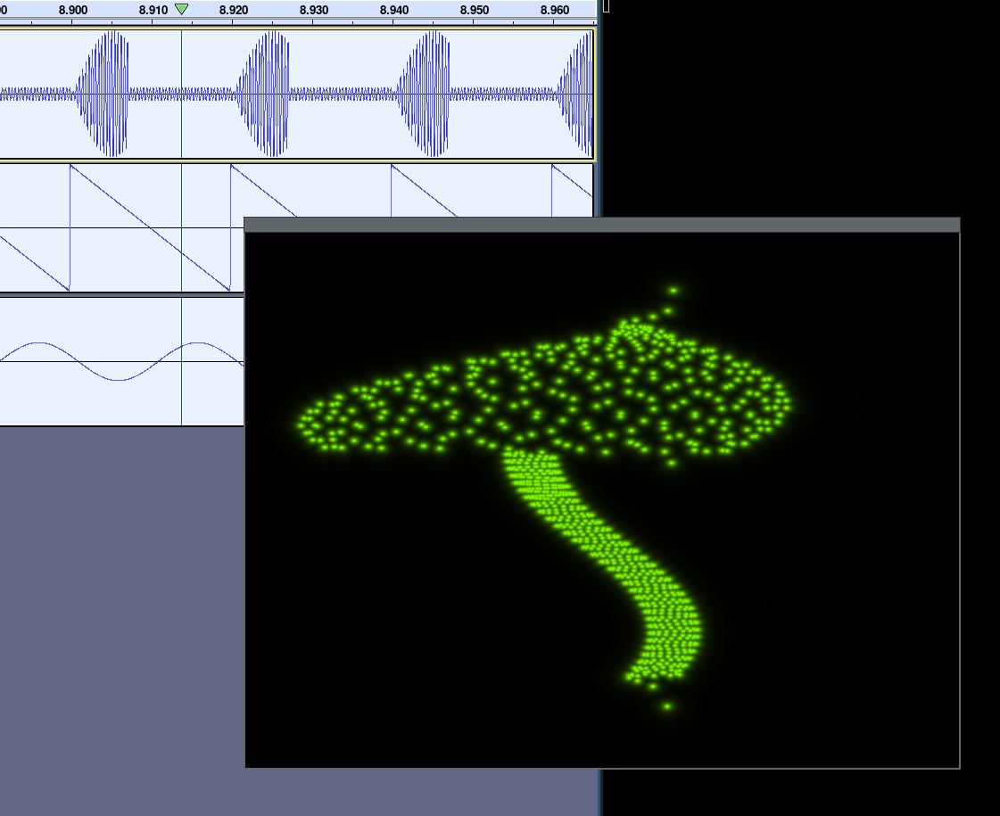
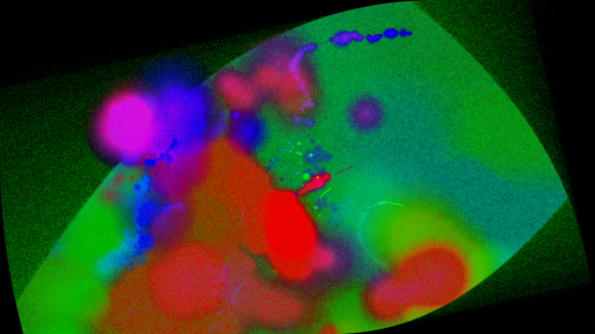

# Funny Stuff With Audio!

```bash
# Compiling
make
# Running
make run
```

For example an XY-oscilloscope tied to the left/right channels of the audio (on some old commit).



Or a music visualizer.




There's also a commit with a "working" ray marcher...

# Visualizer

## Inspired by

https://nestimmersion.ca/nestdrop.php
https://github.com/projectM-visualizer/projectm

# Actual oscilloscope stuff

## [OBSOLETE] Setting up listenable pulse sink.

```
# Find currently active default output.
# This will be the sink for the module-in-the-middle.
pacmd list-sinks | grep -A1 "* index"
DEFAULT_OUTPUT=$(pacmd list-sinks | grep -A1 "* index" | grep -oP "<\K[^ >]+")
echo $DEFAULT_OUTPUT

# Create a sink that pipes stuff through to `$DEFAULT_OUTPUT`
# while allowing `tee`-like data flow forking.
pactl load-module module-combine-sink \
  sink_name=record-n-play slaves=$DEFAULT_OUTPUT \
  sink_properties=device.description="Record-and-Play"
```


## Audacity

The project contains an audacity project for a demo, just
load it up and hit run-in-loop.
This data has been generated by a LISP (nyquist) script (and manually
post-processed the stuff which i did not manage to get into LISP).
To "run" this script you need to select a new, preferably empty (will be
overwritten) audio track (mono?) and hit "Tools->Open Nyquist Prompt". You'll
get a LISP input window where you can put that code.

## Inspired by

https://www.youtube.com/watch?v=qnL40CbuodU

Go take a look at https://oscilloscopemusic.com/
